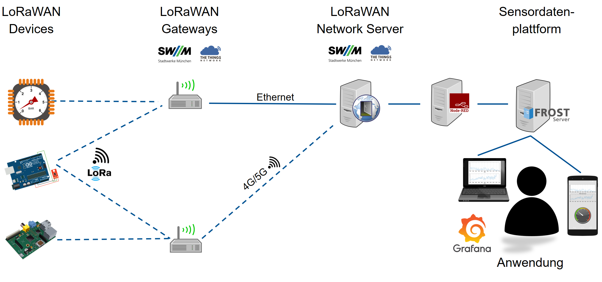
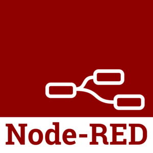

.. index:: test stack

###############################################################################
Testumgebung für SiKla
###############################################################################

Diese Seite beschreibt die IoT-Testinfrastruktur für das Projekt *Sicheres
Klassenzimmer*. Die Infrastruktur ist vollständig auf Basis von Docker Container
realisiert und kann daher sehr einfach in jeder gängigen Cloudplattform oder
auf eigener Hardware ausgerollt werden.

.. rubric:: Ansprechpartner

| Bruno Willenborg
| Technische universität München (TUM)
| Lehrstuhl für Geoinformatik
| b.willenborg(at)tum.de
| +49 89 289-22973
| https://www.asg.ed.tum.de/gis/startseite/

.. index:: service overview

*******************************************************************************
 Übersicht
*******************************************************************************
Die Infrastruktur setzt nach einem LoRaWAN-Netwerkserver (egal von welchem Provider)
an und bietet die folgenden Funktionen:

* Anbindung von beliebigen Netzwerkprovidern, auch Multiproviderlösungen sind möglich.
* Persistente Speicherung von Sensordaten sowie von Informationen/Metadaten
  zu Sensorkoten, Sensoren, Messgrößen und Datenströmen.
* Bereitstellung der Daten über die OGC SensorThingsAPI, die mächtige
  Abfrageoptionen für Sensordaten/Metadaten bietet und leicht zu erlernen ist.
* Alle Softwarekomponenten und Formate sind |:free:| OpenSource |:peace:|

Die Dienste der Testumgebung empfangen Sensordaten z.B. von einem LoRaWAN-Netzwerkserver.
Mit :ref:`test-stack/test-stack:Node-RED` werden die Daten zur SensorThingsAPI konvertiert und
im :ref:`test-stack/test-stack:FROST-Server` gespeichert. Von dort können die Daten
mit standardisierten Request abgefragt werden und z.B. mit :ref:`test-stack/test-stack:Grafana`
visualisiert werden. Alle Dienste sind dabei via Single-SignOn durch :ref:`test-stack/test-stack:Keycloak`
und HTTPS abgesichert. :numref:`iot-overview`

  Übersicht über die LoRaWAN Sensordateninfrastruktur.

* :ref:`test-stack/test-stack:FROST-Server` |:arrow_right:| https://sikla.gis.lrg.tum.de/test/frost
* :ref:`test-stack/test-stack:Grafana` |:arrow_right:| https://sikla.gis.lrg.tum.de/test/grafana
* :ref:`test-stack/test-stack:Node-RED` |:arrow_right:| https://sikla.gis.lrg.tum.de/test/nodered
* :ref:`test-stack/test-stack:Keycloak` |:arrow_right:| https://sikla.gis.lrg.tum.de/test/auth

*******************************************************************************
FROST-Server
*******************************************************************************

.. image:: ../img/frost-server-icon.png
  :width: 120 px
  :align: right
  :alt: FROST-Server logo

Der FROST-Server ist eine Open Source Server-Implementierung der OGC SensorThings API.
Er ist in Java geschrieben und kann in Tomcat oder Wildfly laufen und ist als
Docker-Image verfügbar. Zu seinen vielen Funktionen gehört die Möglichkeit,
String- oder UUID-basierte Entity-IDs zu verwenden. FROST-Server ist ein Akronym
und steht für *Fraunhofer Open Source SensorThingsAPI Server*.
Der Name soll aber auch suggerieren, dass Ihre Daten *frisch und verfügbar*
gehalten werden.

.. rubric:: Funktionen

* Basiert auf SensorThings API, einem Standard des OGC (OGC ist eines der wichtigsten
  internationalen Standardisierungsgremien für Daten mit Raumbezug)
* Hohe Leistungsfähigkeit
* Geringer Ressourcenverbrauch
* Open Source: Volle Transparenz bei der Software

  * Offenheit gegenüber Erweiterungen von Anwendern
  * Offene Verfügbarkeit der Software garantiert langfristige Verfügbarkeit und
    ermöglicht strategische Entscheidungen

.. rubric:: Links

* Official website: https://www.iosb.fraunhofer.de/de/projekte-produkte/frostserver.html
* Github: https://github.com/FraunhoferIOSB/FROST-Server
* Documentation: https://fraunhoferiosb.github.io/FROST-Server/
* OGC SensorWebEnablement Overview: https://www.ogc.org/node/698
* OGC SensorThingsAPI Standard docs: https://www.ogc.org/standards/sensorthings
* OGC SensorThingsAPI API Documentation: https://developers.sensorup.com/docs/
* SensorThingsAPI Beispiele: https://fraunhoferiosb.github.io/FROST-Server/sensorthingsapi/1_Home.html

Testinstanz FROST-Server
===============================================================================

In der Testinstanz wurden Beispieleinträge für einen Sensorknoten (*Thing*) mit
einem *Sensor*, der einen phys. Parameter (*ObservedPropoerty*) misst, erstellt.
Der *Datastream* zu dieser Messreihe wird von :ref:`test-stack/test-stack:Node-RED`
alle 30 Sekunden mit zufälligen Daten gespeist. Die Servereinträge sind hier genauer
beschrieben:

.. toctree::
  :maxdepth: 3

  SensorThingsAPI.rst

|:rocket:| Hier geht es zu Testinstanz: https://sikla.gis.lrg.tum.de/test/frost |:rocket:|

Beispielabfragen für die Testinstanz
-------------------------------------------------------------------------------

* Die letzten 100 Messungen zum Download als CSV-Datei, z.B. als Input für
  Analysetools:

  .. code-block:: text

    https://sikla.gis.lrg.tum.de/test/frost/v1.1/Datastreams(1)/Observations?$ResultFormat=CSV&$select=id,phenomenonTime,result&$orderBy=phenomenonTime%20desc&$top=100

* Die letzten 100 Messungen als JSON, z.B. zur Verwendung in einer App:

  .. code-block:: text

    https://sikla.gis.lrg.tum.de/test/frost/v1.1/Datastreams(1)/Observations?$select=id,phenomenonTime,result&$orderBy=phenomenonTime%20desc&$top=100

* Mehr SensorThingsAPI Beispiele: https://fraunhoferiosb.github.io/FROST-Server/sensorthingsapi/1_Home.html

*******************************************************************************
Grafana
*******************************************************************************

.. image:: ../img/grafana-icon.jpg
  :width: 70 px
  :align: right
  :alt: Grafana logo

Grafana ist eine plattformübergreifende Open-Source-Anwendung zur grafischen
Darstellung von Daten aus verschiedenen Datenquellen wie z. B. InfluxDB, MySQL,
PostgreSQL, Prometheus und Graphite.
Die erfassten Rohdaten lassen sich anschließend in verschiedenen Anzeigeformen ausgeben.
Diese können dann zu sogenannten Dashboards zusammengefügt werden.
Die Anzeigemöglichkeiten und Datenquellen können zudem mittels Plug-ins erweitert werden.
Auf diese Weise wird auch der FROST-Server direkt unterstützt und es können Dashboards
ohne zu programmieren in wenigen Klicks zusammengestellt werden.

.. rubric:: Links

* Official webite: https://grafana.com/
* Github: https://github.com/grafana/grafana
* LinkSmart OGC SensorThingsAPI Plugin: https://github.com/linksmart/grafana-sensorthings-datasource
* |:bar_chart:| |:chart_with_upwards_trend:|  `Beispiel Dashboard <https://sikla.gis.lrg.
  tum.de/test/grafana/d/EyOBeVZ7k/example-dashboard?orgId=1&refresh=30s>`_
  mit den Daten aus dem Testsensorknoten.

Testinstanz Grafana
===============================================================================

Die Testinstanz enthält aktuell zwei Datenquellen mit denen der
:ref:`test-stack/test-stack:FROST-Server` abgefragt werden kann und ein
Beispieldashboard, dass die künstlichen Daten visualisiert, die in
:ref:`test-stack/test-stack:Node-RED` erzeugt werden.

|:rocket:| Hier geht es zu Testinstanz: https://sikla.gis.lrg.tum.de/test/grafana |:rocket:|

.. code-block:: text

  User        admin
  Password    admin

*******************************************************************************
Node-RED
*******************************************************************************

Node-RED ist ein von IBM entwickeltes grafisches Entwicklungswerkzeug.
Die Software ermöglicht es, Anwendungsfälle im Bereich des Internets der Dinge
mit einem einfachen Baukastenprinzip umzusetzen. Die einzelnen Funktionsbausteine
werden durch Ziehen von Verbindungen verbunden. Eine große Auswahl an mitgelieferten
Bausteinen deckt die meisten der gängigsten Dienste und Technologien ab.
Im Jahr 2016 hat IBM Node-RED als Open-Source-Software der JS-Foundation übertragen.

.. rubric:: Links

Testinstanz Node-RED
===============================================================================

Die Testinstanz enthält aktuell einen Workflow, der alle 30 Sekunden einen
zufälligen Wert erzeugt, der via HTTP POST Request als *Observation* dem Test
*Datastream* im :ref:`test-stack/test-stack:FROST-Server` hinzufügt wird.

|:rocket:| Hier geht es zu Testinstanz: https://sikla.gis.lrg.tum.de/test/nodered |:rocket:|

*******************************************************************************
Keycloak
*******************************************************************************

.. image:: ../img/keycloak-icon.png
  :width: 100 px
  :align: right
  :alt: Keycloak icon

Keycloak ist ein Open-Source-Softwareprodukt, das Single Sign-On mit Identity
und Access Management für moderne Anwendungen und Dienste ermöglicht. Seit März
2018 steht das WildFly-Community-Projekt unter der Obhut von Red Hat, die es als
Upstream-Projekt für ihr RH-SSO-Produkt verwenden.

.. rubric:: Funktionen

* User Registration
* Social login
* Single Sign-On/Sign-Off across all applications belonging to the same Realm
* 2-factor authentication
* LDAP integration
* Kerberos broker
* Multitenancy with per-realm customizable skin

.. rubric:: Links

* Official website: https://www.keycloak.org/
* Github: https://github.com/keycloak/keycloak

Testinstanz Keycloak
===============================================================================

Keycloak ist für die Testinstanz aktuell nicht aktiviert, damit alle Dienste
unkompliziert ausprobiert werden können. Unter dem Link unten ist eine laufende
Instanz erreichbar, um sich einen Überblick über die Weboberfläche und die
Funktionen von Keycloak machen zu können.

|:rocket:| Hier geht es zu Testinstanz: https://sikla.gis.lrg.tum.de/test/auth |:rocket:|

.. code-block:: text

  User        admin
  Password    admin
